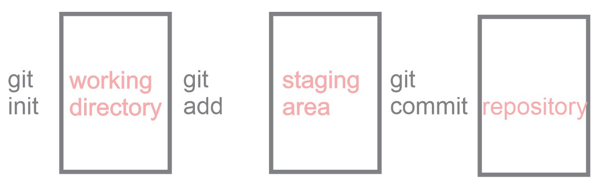
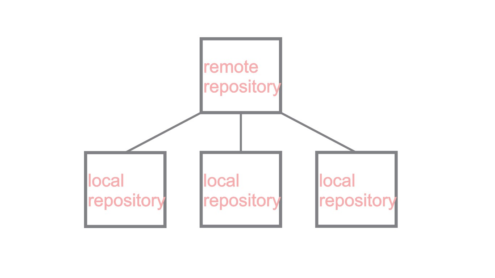

># <span style="color:black">Git</span>

O [Git](https://git-scm.com/) é um sistema de controle de versão distribuído, gratuito e de código aberto, sendo projetado para lidar com projetos de pequeno a grande portes, com velocidade e eficiência

>## <span style="color:pink">Instalação</span>

>#### Linux Debian/Ubuntu
Utilize o comando

```
apt-get install git
```
Para instalação em outras distribuições Linux, consulte [https://git-scm.com/download/linux](https://git-scm.com/download/linux)

>#### Windows

Para instalação em sistema Windows, basta fazer o download do instalador no [link](https://git-scm.com/download/win) e seguir os passos de instalação

>#### Ferramentas de Interface Gráfica (GUI)
Pode-se utilizar o cliente bash do git ou uma ferramenta de interface gráfica do mesmo. O endereço https://git-scm.com/downloads/guis relaciona algumas ferramentas desse tipo segundo a plataforma.

Recomenda-se o uso do próprio bash ou do [Git Kraken](https://www.gitkraken.com/)


>## <span style="color:pink">Branching and Merging</span>
<div align="center">
	
	<br>
    <br>
</div>

>#### __branch__

criar uma branch: `git branch <branch>`

excluir uma branch: `git branch -d <branch>`

>#### __checkout__

alterne para uma branch:`git checkout <branch>`

criar uma nova branch e alternar para a mesma:`git checkout -b <branch>`

excluir modificações em um arquivo no working directory: `git checkout <filename>`
>#### __merge__

fazer o merge de uma branch `develop` na branch atual: `git merge develop` 

>#### __conflitos__
Conflitos surgem na tentativa de merge entre branchs que alteraram arquivos simultaneamente. O Git cria marcações de conflito nos arquivos

```
<<<<<<< HEAD
#IBPAD
=======
#ibpad
>>>>>>> outra
```

Para resolver um conflito deve-se eliminar as marcações criadas pelo git, escolhendo a versão do arquivo que deve permanecer.

>## <span style="color:pink">Staging area</span>
É uma área intermediária na qual os commits podem ser formatados e revisados antes de sua confirmação

<div align="center">
	
	<br>
    <br>
</div>

>#### __add__

adicionar as modificações de um arquivo à staging area: `git add <filename>`

adicionar todas as modificações à staging area: `git add .`
>#### __rm__

remover um arquivo do tracking: `git rm <filename>`

>#### __diff__
verificar as alterações em um arquivo com a sua última versão: `git diff <filename>`

checar diferenças entre commits: `git diff <hash1> <hash2>`

>#### __commit__

realizar o commit das alterações na staging area: `git commit -m "message"`

>#### __reset__

redefinir o repositório para o estado do último commit: `git reset --hard`
redefinir o repositório para o estado de dois commits anteriores: `git reset --hard HEAD~2`
caso dê problema, volte a situação antes do reset: `git reflog`
`git reset --hard <hash>`

>## <span style="color:pink">Remote Repositories</span>

<div align="center">
	
	<br>
    <br>
</div>

>#### __clone__

Clonar um repositório cria uma cópia local de um repositório remoto

clonar um repositório: `git clone repositorio.git`
>#### __fork__

Um fork é uma cópia de um repositório. O fork de um repositório permite que você experimente livremente alterações sem afetar o projeto original.
>#### __pull__

fazer o download das modificações do repositório remoto: `git pull origin <branch>`
>#### __push__

adicionar alterações na branch local para a branch remota: `git push origin <branch>`

>#### __adição de repositório remoto__
Caso se tenha criado e iniciado o git em um repositório local e posteriormente se queira adicionar o repositório ao Github, é preciso adicionar um repositório remoto.
Primeiro, deve-se criar um repositório vazio no Github e, em seguida, adicioná-lo como remoto.

adicionar um repositório remoto: `git remote add origin repository.git`

verificar os repositórios remotos: `git remote -v`