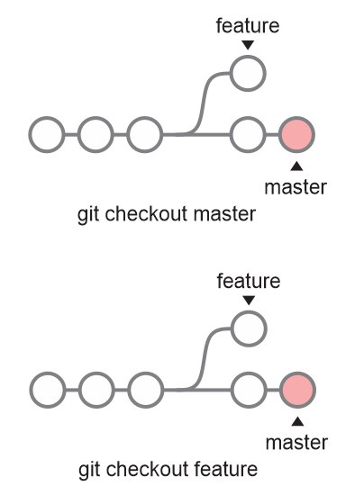

>## Git

O [Git](https://git-scm.com/) é um sistema de controle de versão distribuído, gratuito e de código aberto, sendo projetado para lidar com projetos de pequeno a grande portes, com velocidade e eficiência

>### Instalação

#### Linux Debian/Ubuntu:
Utilize o comando

```
apt-get install git
```
Para instalação em outras distribuições Linux, consulte [https://git-scm.com/download/linux](https://git-scm.com/download/linux)

#### Windows:

Para instalação em sistema Windows, basta fazer o download do instalador no [link](https://git-scm.com/download/win) e seguir os passos de instalação

#### Ferramentas de Interface Gráfica (GUI):
Pode-se utilizar o cliente bash do git ou uma ferramenta de interface gráfica do mesmo. O endereço https://git-scm.com/downloads/guis relaciona algumas ferramentas desse tipo segundo a plataforma.

Recomenda-se o uso do próprio bash ou do [Git Kraken](https://www.gitkraken.com/)


>### Branching and Merging
<div align="center">
	
	<br>
    <br>
</div>

- __branch__

criar uma branch: `git branch <branch>`

excluir uma branch: `git branch -d <branch>`

- __checkout__

alterne para uma branch:`git checkout <branch>`

criar uma nova branch e alternar para a mesma:`git checkout -b <branch>`

excluir modificações em um arquivo no working directory: `git checkout filename`
- __merge__
- __conflitos__

>### Staging area
É uma área intermediária na qual os commits podem ser formatados e revisados antes de sua confirmação
- __add__

adicionar as modificações de um arquivo à staging area: `git add filename`

adicionar todas as modificações à staging area: `git add .`
- __rm__
- __commit__

realizar o commit das alterações na staging area: `git commit -m "message"`

- __reset__

redefinir o repositório para o estado do último commit: `git reset --hard`

>### Remote Repositories

- __clone__

Clonar um repositório cria uma cópia local de um repositório remoto

clonar um repositório: `git clone repositorio.git`
- __fork__

Um fork é uma cópia de um repositório. O fork de um repositório permite que você experimente livremente alterações sem afetar o projeto original.
- __pull__

fazer o download das modificações do repositório remoto: `git pull origin <branch>`
- __push__

adicionar alterações na branch local para a branch remota: `git push origin <branch>`

- __adição de repositório remoto__