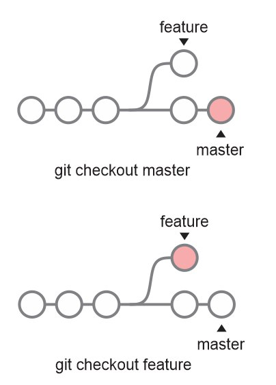

>## Git

O [Git](https://git-scm.com/) é um sistema de controle de versão distribuído, gratuito e de código aberto, sendo projetado para lidar com projetos de pequeno a grande portes, com velocidade e eficiência

>### Instalação

#### Linux Debian/Ubuntu:
Utilize o comando

```
apt-get install git
```
Para instalação em outras distribuições Linux, consulte [https://git-scm.com/download/linux](https://git-scm.com/download/linux)

#### Windows:

Para instalação em sistema Windows, basta fazer o download do instalador no link [https://git-scm.com/download/win](https://git-scm.com/download/win) e seguir os passos de instalação

#### Ferramentas de Interface Gráfica (GUI):
Pode-se utilizar o cliente bash do git ou uma ferramenta de interface gráfica do mesmo. O endereço https://git-scm.com/downloads/guis relaciona algumas ferramentas desse tipo segundo a plataforma.

Recomenda-se o uso do próprio bash ou do [Git Kraken](https://www.gitkraken.com/)


>### Branching and Merging
<div align="center">
	
	<br>
    <br>
</div>

- branch
- checkout
- merge
- conflitos

>### Staging area
É uma área intermediária na qual os commits podem ser formatados e revisados antes de sua confirmação
- add
- rm
- commit

>### Remote Repositories
- clone
- fork
- pull
- push
- adição de repositório remoto